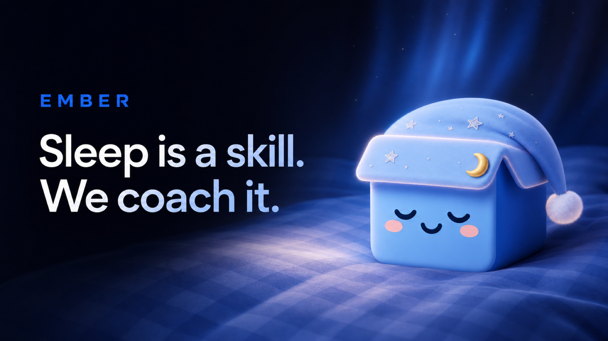

# EMBER

[English](README.md) · [简体中文](README.zh-CN.md) · [日本語](README.ja.md)



**Sleep is a skill. We coach it.**

EMBER is a personal rest coach for iPhone. It turns sleep data, calendar events,
daily rhythm, local weather, and bedroom conditions into one clear,
personalized plan for tonight.

## What EMBER does

- Builds a nightly plan with wind-down, lights-out, and wake times.
- Reads sleep and activity signals from Apple Health with read-only access.
- Adapts around early meetings, late events, travel, sunrise, and temperature.
- Provides a streaming AI Rest Coach grounded in the user's own plan.
- Includes rule-based coaching when no AI provider is configured.
- Supports Sleep Window Training, CBT-I-inspired sleep efficiency, and Thermal
  Wind-Down protocols.
- Schedules wake alarms and wind-down reminders.
- Turns a spoken mind dump into editable text.
- Adds social motivation through Box Space, friends, points, rewards, and
  collectible Blue Box skins.

## Product experience

### Tonight

One plan that explains what to do next and why it changed.

### Agenda and Daily Rhythm

Calendar events are placed against a personalized circadian energy curve.
EMBER can move the plan before an early start or a late night causes disruption.

### Rest Coach

The coach combines the current plan, sleep trends, calendar context, and
evidence-based guidance. Responses can stream from an OpenAI-compatible endpoint
through OpenRouter.

### Rest Lab

Sleep Window Training and Thermal Wind-Down turn sleep science into small,
trackable actions.

### Box Space

Healthy routines earn sleep points and unlock Blue Box skins. Supabase powers
accounts, friendships, requests, rewards, and leaderboards.

## Technology

- **iOS:** Swift 5, SwiftUI, Swift Charts, Swift Concurrency, Combine
- **Apple frameworks:** HealthKit, EventKit, CoreLocation, AlarmKit,
  UserNotifications, BackgroundTasks, Speech, AVFoundation, Security/Keychain
- **Backend:** Supabase Swift, Supabase Auth, PostgreSQL, RPC
- **AI:** OpenRouter, OpenAI-compatible Chat Completions, SSE streaming
- **Environment data:** Open-Meteo API
- **Website:** Next.js 16, React 19, TypeScript, CSS, pnpm, Vercel
- **Product film:** Remotion 4, React, TypeScript
- **Project generation:** XcodeGen and Swift Package Manager

## Repository

```text
Ember/                    iOS application
  AI/                     LLM client and calendar categorization
  Alarms/                 Wake alarms and reminders
  Algorithms/             Circadian, sleep-window, thermal, and plan engines
  Calendar/               EventKit integration
  Data/                   App state, Supabase, and live-data assembly
  Health/                 HealthKit import and sleep metrics
  Services/               Weather, location, climate, cache, and friends
  Views/                  SwiftUI product experience
  Assets.xcassets/        App icon, Blue Box skins, and brand artwork
official-website/         Next.js marketing website
video/                    Remotion product film
promotional-materials/    Posters, social assets, and feature modules
project.yml               XcodeGen project definition
```

## Run the iOS app

Requirements:

- macOS with Xcode 16 or newer recommended
- iOS 17.6 deployment target
- A physical iPhone is recommended for HealthKit, location, microphone, and
  notification testing

Open the committed project:

```bash
open Ember.xcodeproj
```

In Xcode, select your development team and a unique bundle identifier, then
build the `Ember` target.

To regenerate the project after changing `project.yml`:

```bash
brew install xcodegen
xcodegen generate
```

AlarmKit wake alarms are enabled when built with an SDK that provides AlarmKit
and run on iOS 26.1 or later. Other reminder features remain available on the
main deployment target.

## Optional AI setup

Open EMBER Settings and enter an OpenRouter API key. The key is stored in the
iOS Keychain. The model and OpenAI-compatible base URL can be changed in the
app. Without a key, the rule-based Rest Coach remains available.

## Run the official website

```bash
cd official-website
pnpm install
pnpm dev
```

Open `http://localhost:3000`.

For Vercel, import this Git repository and set the Root Directory to
`official-website`. The included `vercel.json` supplies the install and build
commands.

## Run the product film

```bash
cd video
npm install
npm start
```

Render the final video with `npm run build`.

## Brand and promotional materials

The Blue Box character, app icon, checked bedding, and skin artwork come from
`Ember/Assets.xcassets`. Website-ready copies live in
`official-website/public/assets`.

Finished campaign assets are in [`promotional-materials`](promotional-materials),
including 16:9 posters, website feature modules, a square social post, and a
vertical Story/Reel cover. See the
[`campaign guide`](promotional-materials/campaign-guide.md) for approved copy,
colors, usage, source references, and production prompts.

## Product copy

> Sleep is a skill. We coach it.

> A tracker tells you about last night. EMBER tells you what to do tonight.

> Your signals. One clear recommendation.

> Evidence in. Better nights out.

## Privacy and scope

Apple Health access is read-only. Raw sleep and recovery data is processed on
the device; social account and Box Space data use Supabase. EMBER is a wellness
tool, not a medical device, and does not diagnose or treat sleep disorders.
